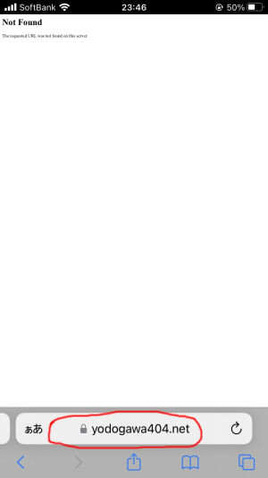
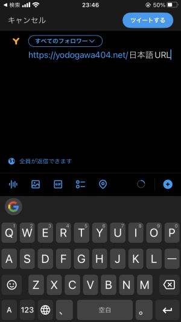
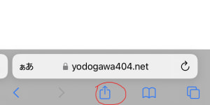
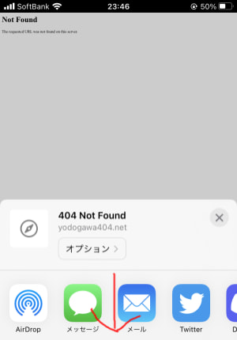
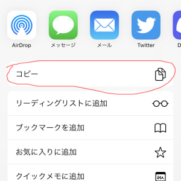
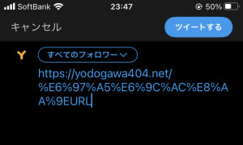

こんばんは、よどがわです。  
今回はiOSのSafariで日本語の含まれたURLを共有する方法を紹介します。

## なぜ必要なのか

例えば、 `https://yodogawa404.net/日本語URL` というURLを共有したいときに、
画像の部分からURLを選択してコピーすると、

日本語の部分がエンコードされずにコピーされます。

このままツイートしてしまうと、日本語の部分がURLの一部として認識されず、
意図しないURLに転送されてしまいます。

## 対処法

対処法としては、画面下部の共有マークをタップして、

出てきた画面をスクロールし、

コピーを押します。

すると今度はエンコードされたURLがされるので、意図したURLに転送されます。

